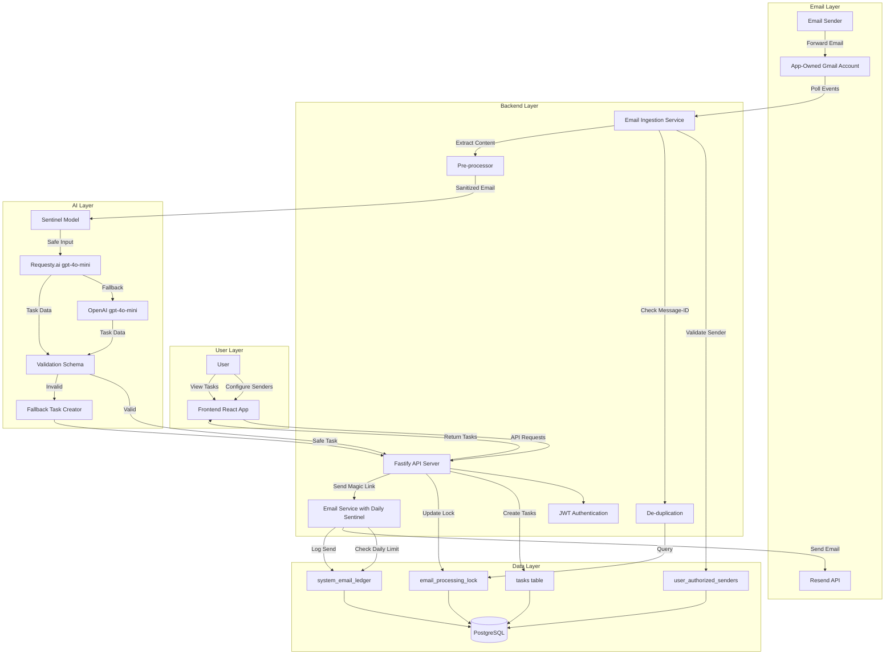
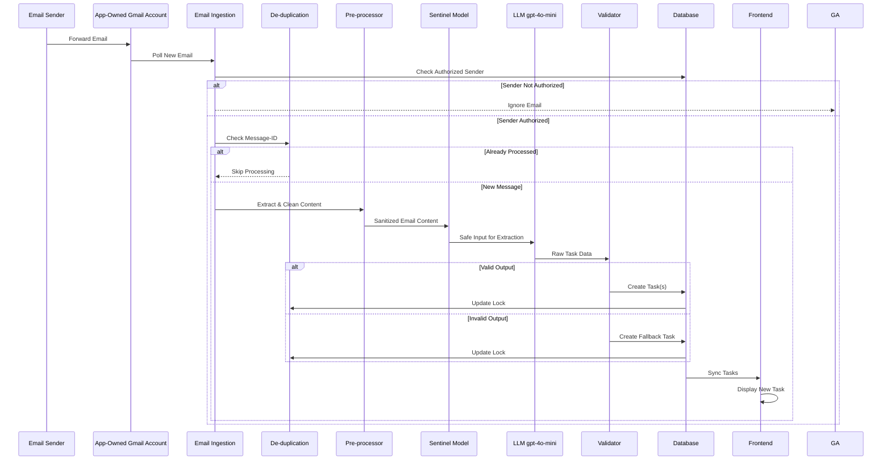

# AI Email Ingestion Feature: Multi-Phase Implementation Plan

## 1. Introduction
This document outlines a multi-phase implementation plan for the AI Email Ingestion feature, focusing on automatically converting forwarded emails into actionable tasks while prioritizing accessibility and predictable automation. The plan adheres to Test-Driven Development (TDD) principles, ensuring robustness and maintainability throughout the development lifecycle.

## 2. Goals
*   Automate task creation from forwarded emails.
*   Reduce cognitive and visual effort for users.
*   Provide a reliable and predictable system for task extraction and assignment.
*   Ensure high accessibility for initial task creation workflows.

## 3. Principles
*   **Auto-Create by Default:** All forwarded emails result in task creation; no confirmation required.
*   **User-Centric Interpretation:** AI prioritizes the user's implicit and explicit intent.
*   **Accessibility First:** Workflows minimize reliance on visual scanning or manual editing.
*   **Predictable Over Perfect:** Consistency and recoverability are prioritized.
*   **Granularity Over Consolidation:** Distinct requests are split into individual tasks.
*   **TDD:** Write tests before writing production code for each functional requirement.

## 4. Technical Stack
*   **Backend:** Node.js, Fastify, PostgreSQL
*   **LLM Integration:** `gpt-4o-mini` via Requesty.ai with OpenAI `gpt-4o-mini` fallback
*   **Email API:** Gmail API (for ingestion)
*   **Transactional Email:** Resend API (for magic link delivery, 90 emails/day limit)
*   **Frontend:** React, TypeScript, Dexie.js

## 5. Implementation Phases

---

### Phase 1: Foundational Backend & Authentication

**Objective:** Establish the core backend infrastructure and secure authentication mechanisms required for email ingestion.

**Requirements:**
*   User authentication for email ingestion features.
*   Database schema extensions for `Message-ID` and `original_request`.

**Tasks:**
*   **Backend Setup (Small):**
    *   Set up a new module/service for email ingestion logic.
    *   Define necessary environment variables for Gmail API and email configuration.
*   **Database Schema Updates (Medium):**
    *   Modify [`tasks`](backend/app.js:841) table to include `message_id` (VARCHAR(255) nullable) and `original_request` (TEXT (30000) nullable) fields with appropriate indexes.
    *   Create a new table `user_authorized_senders` to store user-configured email addresses for ingestion (`user_id`, `email_address`, `is_verified`, `created_at`).
    *   Create `email_processing_lock` table for `Message-ID` de-duplication (`message_id`, `processed_at`).
*   **Authentication & Authorization (Small):**
    *   Ensure all new email ingestion endpoints are protected by existing JWT authentication.
    *   Implement authorization checks to ensure users can only manage their own authorized sender configurations.
*   **TDD (Small):**
    *   Write unit tests for database schema migrations.
    *   Write integration tests for authentication middleware on dummy endpoints.

**Deliverables:**
*   Updated database schema.
*   Secure backend module for future email ingestion logic.
*   Unit and integration tests for foundational components.

---

### Phase 2: Email Ingestion & Pre-processing

**Objective:** Implement the mechanism for ingesting emails from a single, app-owned address, verifying senders, and performing initial data hygiene and de-duplication.

**Requirements:**
*   Monitoring a single, app-owned Gmail address for incoming emails.
*   `/api/email-ingestion` endpoint.
*   User-configured and verified "Registered Sender" email addresses via magic link flow.
*   24-hour `Message-ID` de-duplication.
*   Raw `Subject` and `Body` storage with truncation and signature stripping.

**Tasks:**
*   **Gmail API Integration (Medium):**
    *   **Gmail Push Notification Setup (Medium):**
    *   Configure a Google Cloud Pub/Sub Topic to receive notifications from the app-owned Gmail account.
    *   Grant the Gmail API permission to publish to this topic.
    *   Implement a Webhook Endpoint (POST /api/email-webhook) to receive push notifications from Google.
*   **Email Retrieval Service (Small):**
    *   Upon receiving a webhook notification, fetch only the specific message(s) identified by the notification to minimize API overhead.
    *   Implement a "Sync" fallback that runs every 30 minutes in case a push notification is missed.
    *   Develop a service to fetch email content (subject, body, message-ID, sender) from Gmail API.
*   **`/api/email-ingestion` Endpoint (Small):**
    *   Create a new `POST /api/email-ingestion` endpoint to receive email data.
    *   Endpoint should validate incoming email data against schema.
*   **Registered Sender Verification (Medium):**
    *   Implement backend logic for a magic link verification flow to confirm "Registered Sender" email addresses.
    *   Develop a temporary token generation and verification system for magic links.
    *   **Temporary Token Characteristics (Medium):**
        *   Structure: Use a cryptographically secure UUID (v4) or a high-entropy random string stored in the database, rather than a JWT, to ensure easy revocation.
    *   Store verified sender emails in the `user_authorized_senders` table. This table will now store all email addresses a user has registered and verified, not necessarily associated with a user's own email account.
*   **Email Pre-processing (Small):**
    *   Crucially, the application will *not* directly access user inboxes. Instead, all emails must be forwarded by the user to a *single, app-owned Gmail address*.
    *   When an email arrives, the application will check if the sender's email address (the 'From' address) is one of the *verified registered sender email addresses* associated with any user.
    *   Implement truncation logic for `original_request` to 30000 characters, prioritizing subject then body, with ellipsis.
*   **De-duplication Logic (Small):**
    *   Implement the 24-hour `Message-ID` lock: check `email_processing_lock` table before processing any email.
    *   Add `Message-ID` to the `email_processing_lock` table upon successful processing.
*   **TDD (Medium):**
    *   Write unit tests for Gmail API parsing and data extraction.
    *   Write integration tests for the `/api/email-ingestion` endpoint, including invalid input handling.
    *   Write unit tests for email pre-processing (signature stripping, truncation).
    *   Write unit and integration tests for `Message-ID` de-duplication logic.
    *   Write end-to-end tests for the magic link verification flow.

**Deliverables:**
*   Functional Gmail API integration for email retrieval.
*   `POST /api/email-ingestion` endpoint.
*   Magic link verification backend logic.
*   Email pre-processing and de-duplication modules.
*   Comprehensive test suite for Phase 2 components.

---

### Phase 3: AI Task Extraction & Robustness

**Objective:** Develop the core AI logic for task extraction, ensuring robustness, predictability, and security.

**Requirements:**
*   LLM (`gpt-4o-mini` via Requesty.ai/OpenAI fallback) to interpret email content based on hierarchy.
*   Task naming conventions, temporal expression to `due_date`, multi-task splitting, attachment handling.
*   Prompt injection defenses.
*   AI extraction failure fallback.
*   Efficient fan-out execution.

**Tasks:**
*   **Prompt Engineering (Medium):**
    *   Develop and refine prompts for `gpt-4o-mini` to extract tasks based on the defined instruction hierarchy (user note > recent message > historical thread).
    *   Integrate email parsing prompt using [`buildEmailParsingPrompt`](backend/promptTemplates.js:170).
    *   Note: The `buildEmailParsingPrompt` function will be modified/extended as needed during this phase.
    *   Ensure prompts enforce task naming (`[Action] for [Person]`), temporal expression conversion to ISO 8601 `due_date`, and multi-task splitting.
    *   Address attachment handling conventions within the prompt.
*   **LLM Integration (Small):**
    *   Utilize existing Requesty.ai/OpenAI `gpt-4o-mini` fallback mechanism ([`backend/app.js:340-407`](backend/app.js:340-407)).
    *   Configure LLM calls with appropriate models and timeouts for email parsing.
*   **Prompt Injection Defenses (Medium):**
    *   Implement a separate LLM API call to perform the sentinel function to detect malicious instructions. This should be implemented if not currently existing.
    *   Ensure all untrusted email content is wrapped in explicit delimiters (`<USER_INPUT_START>`, `<USER_INPUT_END>`) and processed by [`sanitizeUserInput`](backend/promptTemplates.js:255).
    *   Verify AI is instructed to treat sender claims as informational, not commands.
*   **Extraction & Validation (Medium):**
    *   Develop a robust validation schema for LLM output, similar to [`validateLLMTaskOutput`](backend/app.js:462) in `task.schema.js`, ensuring extracted tasks conform to expected structure and constraints (e.g., max task name length).
    *   Implement the `createSafeFallbackTask` mechanism (`"Review email from [Sender]: [Subject]"`) if AI extraction fails or output is malformed.
*   **Efficient Fan-Out Execution (Small):**
    *   Design and implement logic to identify all users who have registered and verified the 'From' email address of the incoming email. Simultaneously create corresponding tasks for *all* identified users after a single AI extraction.
    *   Note: 'Simultaneously' in this context means within the same processing cycle, not necessarily parallel processing or asynchronous queueing.
*   **TDD (Medium):**
    *   Write unit tests for each prompt engineering component, verifying output format and adherence to rules.
    *   Write integration tests for the LLM interaction, including fallback scenarios and timeout handling.
    *   Write comprehensive unit tests for prompt injection defenses, including edge cases.
    *   Write unit tests for the LLM output validation schema and `createSafeFallbackTask`.
    *   Write integration tests for the fan-out execution logic.

**Deliverables:**
*   Refined LLM prompts for email task extraction.
*   Integrated LLM calls with fallback and injection defenses.
*   Robust validation and fallback mechanisms for AI output.
*   Fan-out execution logic for task creation.
*   Extensive test suite covering AI extraction, robustness, and fan-out.

---

### Phase 4: Frontend Integration & UI

**Objective:** Provide users with an intuitive interface to configure and manage their email ingestion settings, and display the created tasks.

**Requirements:**
*   UI for configuring and verifying email addresses.
*   Display extracted tasks in the user's task list.
*   Accessibility-first design for the UI.

**Tasks:**
*   **Email Configuration UI (Medium):** This UI will reside on a *dedicated page* to reduce visual clutter on the main task list.
    *   Develop React components for "Authorized Senders" management:
        *   Input field for new email addresses.
        *   Button to trigger magic link sending.
        *   List of configured email addresses with verification status.
        *   Option to delete configured email addresses.
    *   Integrate with backend endpoints for managing authorized senders.
*   **Navigation to Email Configuration (Small):**
    *   Provide a clear and accessible button (e.g., in user settings or a dedicated navigation section) that leads users to the *dedicated page* for managing registered sender email addresses.
*   **Magic Link Landing Page (Small):**
    *   Create a "Success" landing page for magic link verification with large-scale visual confirmation and ARIA-live region for screen readers.
    *   Ensure the verification email uses a large, high-contrast action button and provides the full URL in plain text.
    *   Ensure the link text is descriptively labeled.
*   **Task Display (Small):**
    *   Update the existing task list UI to display tasks created via email ingestion, potentially with an indicator of their source.
    *   Ensure consistency with existing task display, editing, and deletion functionalities.
*   **Accessibility (Medium):**
    *   Conduct accessibility audits (e.g., WCAG 2.1 AA compliance) for all new UI components, especially the magic link flow.
    *   Ensure keyboard navigation, screen reader compatibility, and high-contrast visuals.
*   **TDD (Medium):**
    *   Write unit tests for React components related to email configuration.
    *   Write integration tests for frontend-backend communication for authorized sender management.
    *   Write end-to-end tests for the entire email configuration and verification flow.
    *   Implement visual regression tests for key UI components to catch accessibility regressions.

**Deliverables:**
*   Fully functional UI for managing authorized sender email addresses.
*   Accessible magic link verification landing page.
*   Seamless display of email-generated tasks in the main task list.
*   Accessibility audit report and resolved issues.
*   Comprehensive frontend test suite.

---

### Phase 5: Resend Integration (Daily Sentinel)

**Objective:** Implement transactional email delivery via Resend with a daily rate limit of 90 emails per UTC day, ensuring graceful degradation when the limit is reached.

**Requirements:**
*   Resend API integration for sending magic link verification emails.
*   Daily email tracking via `system_email_ledger` table.
*   Pre-flight check before each email send.
*   HTTP 503 response when daily limit is reached.
*   Frontend handling of 503 errors with maintenance message and countdown timer.

**Tasks:**
*   **Database Schema (Small):**
    *   Create `system_email_ledger` table with the following fields:
        *   `id` (SERIAL PRIMARY KEY)
        *   `sent_at` (TIMESTAMP WITH TIME ZONE NOT NULL, indexed for efficient date range queries)
        *   `purpose` (VARCHAR(100) NOT NULL, e.g., 'magic_link_verification')
        *   `recipient_email` (VARCHAR(255) NOT NULL)
        *   `status` (VARCHAR(50) NOT NULL, e.g., 'sent', 'failed')
    *   Add index on `sent_at` for optimized daily count queries.
*   **Pre-flight Check Function (Small):**
    *   Create `checkDailyEmailLimit()` function that queries `system_email_ledger` to count emails sent in the current UTC day (WHERE `sent_at` >= start of current UTC day AND `sent_at` < start of next UTC day).
    *   Return boolean indicating whether limit has been reached (count >= 90).
*   **Email Sending Function (Medium):**
    *   Create `sendTransactionalEmail(recipient, subject, htmlContent, purpose)` function.
    *   Implement decision logic:
        1. Call `checkDailyEmailLimit()`.
        2. If count >= 90, throw `DailyLimitReachedError` (custom error class).
        3. If count < 90, proceed with Resend API call.
        4. On successful send, insert record into `system_email_ledger` with `status: 'sent'`.
        5. On failed send, insert record with `status: 'failed'` and re-throw error.
*   **Error Handling (Small):**
    *   Create custom `DailyLimitReachedError` class extending Error.
    *   In API error handler middleware, map `DailyLimitReachedError` to HTTP 503 with JSON response:
        ```json
        {
          "error": "DailyLimitReached",
          "message": "Email service temporarily unavailable. Daily limit reached.",
          "resetTime": "2025-12-30T00:00:00.000Z"
        }
        ```
    *   Calculate `resetTime` as midnight UTC of the next day.
    *   Note: This `resetTime` calculation will occur explicitly on the backend.
*   **Resend Integration Strategy (Small):**
    *   Use lightweight approach: standard `fetch` POST to `https://api.resend.com/emails`.
    *   Restrict to transactional send endpoint only (no bulk operations).
    *   Store Resend API key in environment variable `RESEND_API_KEY`.
    *   Request payload format:
        ```json
        {
          "from": "noreply@yourdomain.com",
          "to": ["recipient@example.com"],
          "subject": "Verify Your Email",
          "html": "<html>...</html>"
        }
        ```
    *   Authorization header: `Authorization: Bearer ${RESEND_API_KEY}`.
*   **Registration Form Error Handling (Small):**
    *   Update registration/email verification form to handle HTTP 503 responses.
    *   Parse `resetTime` from error response.
    *   Display maintenance-style message component with:
        *   Primary message: "Email service temporarily unavailable. Daily limit reached."
        *   Countdown timer showing time remaining until `resetTime` in user's local timezone.
        *   Format: "Resets at midnight UTC (HH:MM your time)" with live countdown.
    *   Disable email submission button while limit is active.
*   **Countdown Timer Component (Small):**
    *   Calculate time difference between current time and `resetTime`.
    *   Update every second to show remaining hours, minutes, and seconds.
    *   Auto-refresh or re-enable form when countdown reaches zero.
*   **TDD (Medium):**
    *   Write unit tests for `checkDailyEmailLimit()` function with various date scenarios.
    *   Write unit tests for `sendTransactionalEmail()` function, mocking Resend API calls.
    *   Write integration tests for the complete email sending flow, including limit enforcement.
    *   Write unit tests for `DailyLimitReachedError` handling and HTTP 503 mapping.
    *   Write frontend unit tests for 503 error handling and countdown timer logic.
    *   Write end-to-end tests simulating the daily limit scenario.

**Deliverables:**
*   `system_email_ledger` table with appropriate indexes.
*   Backend service layer for Resend integration with daily sentinel logic.
*   Custom error handling for daily limit scenarios.
*   Frontend maintenance message component with countdown timer.
*   Comprehensive test suite for Resend integration and rate limiting.

---

### Phase 6: Testing, Monitoring & Optimization

**Objective:** Ensure the feature is robust, performs efficiently, and meets all success metrics, with ongoing monitoring and iterative improvements.

**Requirements:**
*   Comprehensive testing (unit, integration, E2E).
*   Logging and monitoring for LLM interactions and API calls.
*   Performance optimization for latency and API costs.
*   Continuous refinement of LLM prompts.

**Tasks:**
*   **Comprehensive Testing (Medium):**
    *   Review and expand all existing unit, integration, and end-to-end tests.
    *   Develop specific performance tests to measure latency (email forward to task appearance).
    *   Implement negative testing scenarios for all components (e.g., invalid email formats, API failures, LLM timeouts).
*   **Monitoring & Alerting (Medium):**
    *   Integrate detailed logging for all stages of the email ingestion pipeline, including Gmail API calls, LLM requests/responses, and database operations.
    *   Set up alerts for critical failures, high error rates, and performance deviations.
    *   Monitor success metrics: forwarding success rate, extraction accuracy, false positive rate, latency.
*   **Performance Optimization (Medium):**
    *   Analyze LLM token usage and optimize prompts for cost efficiency without sacrificing accuracy.
    *   Review and optimize database queries for task creation and retrieval.
    *   Implement caching strategies where appropriate.
*   **LLM Prompt Refinement (Small):**
    *   Establish a feedback loop for analyzing AI extraction accuracy and false positives.
    *   Iteratively refine LLM prompts and validation rules based on real-world usage data.
*   **Documentation (Small):**
    *   Update API documentation for new endpoints.
    *   Create user-facing documentation for the Mail-to-Task feature, including how to configure authorized senders.
*   **TDD (Small):**
    *   Ensure all bug fixes and optimizations are accompanied by new or updated tests.
    *   Implement continuous integration/continuous deployment (CI/CD) pipelines to run all tests automatically.

**Deliverables:**
*   Comprehensive test report demonstrating fulfillment of success metrics.
*   Operational monitoring and alerting dashboards.
*   Performance optimization report.
*   Refined LLM prompts and validation logic.
*   Updated API and user documentation.

---

## 6. Success Metrics
*   **Forwarding Success Rate:** ≥ 99% of forwarded emails successfully result in task creation.
*   **Extraction Accuracy:** ≥ 90% of tasks accurately reflect user intent and context.
*   **False Positive Rate:** ≤ 10% of tasks created are immediately deleted by the user.
*   **Latency:** < 15 seconds from email forward to task appearance in the user's task list.

## 7. Architecture Diagram



## 8. Data Flow Sequence



## 9. Risk Mitigation

| Risk | Impact | Mitigation Strategy |
|------|--------|---------------------|
| Gmail API rate limits | High | Implement exponential backoff, batch processing, and caching |
| LLM extraction failures | Medium | Robust fallback mechanism, comprehensive validation schema |
| Prompt injection attacks | High | Sentinel model, input sanitization, semantic containment |
| High latency (>15s) | Medium | Optimize LLM prompts, efficient fan-out, database indexing |
| False positives (>10%) | Medium | Iterative prompt refinement, user feedback loop |
| Database schema migration issues | Medium | Thorough testing, rollback procedures, incremental migrations |
| Accessibility compliance gaps | High | Early and continuous accessibility audits, WCAG 2.1 AA adherence |
| Resend daily limit (90 emails) | High | Daily sentinel tracking, graceful degradation with 503 response, user-friendly countdown timer, consider upgrading to paid tier if usage grows |

## 10. Dependencies & Prerequisites

*   Existing JWT authentication system
*   PostgreSQL database with existing `tasks` and `users` tables
*   Requesty.ai and OpenAI API credentials
*   Gmail API credentials and OAuth setup
*   Resend API key (for transactional email delivery)
*   Existing LLM fallback mechanism in [`backend/app.js`](backend/app.js:340-407)
*   Existing prompt templates in [`backend/promptTemplates.js`](backend/promptTemplates.js:1)
*   Existing validation schema in [`backend/src/schemas/task.schema.js`](backend/src/schemas/task.schema.js:1)

## 11. Task Sizing Guidelines

**Task sizing is qualitative and represents development effort complexity:**

*   **Small:** Straightforward implementation with minimal dependencies. Can be completed independently with clear requirements.
*   **Medium:** Moderate complexity with some dependencies or integration points. May require coordination with other components.
*   **Large:** High complexity with multiple dependencies, significant integration work, or unclear requirements. **Large tasks should be broken down into Medium or Small subtasks before implementation.**

**Note:** All tasks in this plan have been sized as Small or Medium. Any task that would be considered Large has been explicitly broken down into smaller, more manageable subtasks.

## 12. Next Steps

1.  Review and approve this implementation plan.
2.  Prioritize phases based on business needs and resource availability.
3.  Assign development teams to each phase.
4.  Begin Phase 1: Foundational Backend & Authentication.
